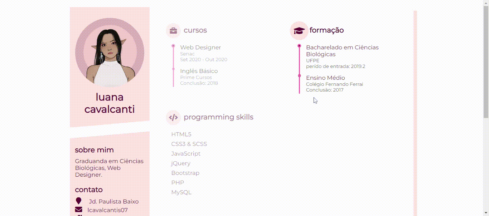

# Portfolio
  

## Função:
* Website desenvolvido durante o curso de Web desing, com objetivo de expor todos os projetos realizados durante o ensino.

## Ferramentas e tecnologias usadas:
1. HTML, CSS, JS, PHP 
2. Bootstrap  
2. Visual Studio Code

## Tela inicial

 
 

## Currículo Online

## Site com tema Pet Shop
 

